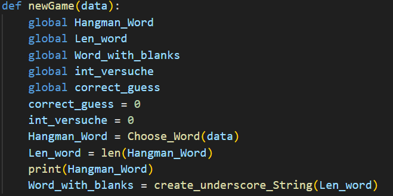
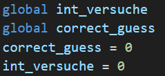
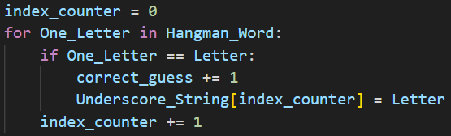
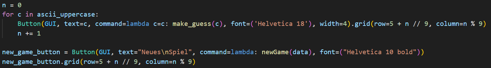
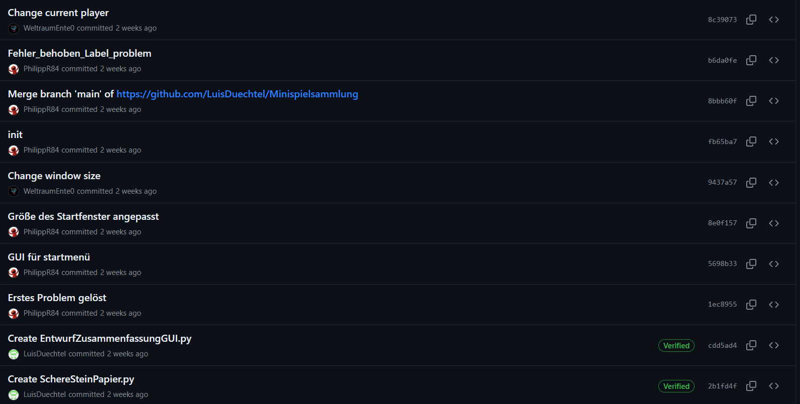

<!-- https://github.com/skills/communicate-using-markdown -->

Martrikelnummern:
- 8595958
- 6812340
- 3844189

# Grading Criteria Programmieren T3INF1004
In jedem Unterbereich werden die Punkte (gerne auch Links ins GIT) erklärt, wie das LO erreicht worden ist.
Alle Kriterien betreffen nur die Projektarbeit. Beweismaterial kommt aus dem Gruppenprojekt.

## FACHKOMPETENZ (40 Punkte)

# Die Studierenden kennen die Grundelemente der prozeduralen Programmierung. (10)

Prozedurale Programmierung besteht aus folgenden grundlegenden Elementen:
- Funktionen
- Variablen 
- Kontrollstrukturen (Schleifen und Abfragen)

In unserem Python-Projekt haben wir unser gelerntes Wissen über die Programmierung angewendet und alle Elemente verwendet. Im Folgenden sind paar Beispiele aus dem Code auflistet.

### Funktionen:
Es wurden Funktionen im Code verwendet, damit man den Code leichter lesen kann und er strukturierter ist. Zusätzlich kann eine Funktion öfters in einem Programmdurchlauf aufgerufen werden.
Da z.B. im Spiel Hangman weiter Wörter erraten möchte, haben wir ein Button "Neues Spiel" eingebaut. Dieser Button führt eine Variable aus die Variablen zurücksetzt, damit man ein neues Spiel starten kann.

### Variablen:

In dem folendem Bild aus dem Code "Hangman_V2.py" sieht man gut das Variablen verwendet deklariert worden sind.

Zusätzlich wurde das Schlüsselwort "global" verwendet, da die Variable in einer Funktion deklariert worden ist. Durch "global" ist die Variable nicht nur lokal ind er Funktion sondern auch außerhalb der Funktion aufrufbar ist.

### Kontrollstrukturen (Schleifen und Abfragen):
Kontrollstrukturen beinhalten zum Beispiel For-Schleifen und If-Abfragen.
Im folgenden Bild wurde eine Schleife und Abfrage verwendet um zu überprüfen ob der eingegebe Buchstaben im gesuchten Wort vorhanden ist. Da ein Buchstabe mehrfach vorhanden sein kann benötigt man eine Schleife.

# Sie können die Syntax und Semantik von Python (10)
Worauf ich stolz bin ist die Tastatur-GUI.
Durch die For-Schleife und ascii_uppercase wurde eine Tastatur mit Buttons gebaut.
Wenn ein Button ausgewählt wird, wird eine Funktion ausgeführt, die den Buchstaben im gesuchten Wort prüft.
Durch den Button "Neues Spiel" wird die Funktion "new-Game" ausgeführt und das Spiel wird mit einem neuen Wort gestartet.

# Sie können ein größeres Programm selbständig entwerfen, programmieren und auf Funktionsfähigkeit testen (Das Projekt im Team) (10)
Das Projekt wurde mit Luis Düchtel (LuisDuechtel) Robin Schuch (WeltraumEnte0) und Philipp Rambacher (PhilippR84) durchgeführt.
Die Idee zur Spielesammlung haben wir durch ChatGPT gefunden. 
Wir sind der Meinung, dass aufgrund der Zeit und unserem Können das Projekt gut gewählt worden ist. 
Wir haben uns dauerhaft oft über Discord kommuniziert, damit jeder auf dem aktuellen Stand ist, wie das Projekt steht.
Zusätzlich haben wir ein gemeinsames GIT-Repo aufgebaut.
Das war für uns alle neu, da wir bisher noch nicht viel mit GIT gearbeitet haben.
Da jeder an seinem eigenen Teil-Projekt arbeiten konnte, ohne jemand anderen zu stören haben wir nicht viel commited sondern eher lokal gearbeitet. 
Trotzdem haben wir wenn wir uns besprochen haben oder Probleme hatten unseren aktuellen Stand auf Git gepusht.
Im folgedem sieht man ein ausschnit aus GIT:

# Sie kennen verschiedene Datenstrukturen und können diese exemplarisch anwenden. (10)
<!-- Eine Stelle aus dem Projekt wählen auf die sie besonders stolz sind und begründen -->

## METHODENKOMPETENZ (10 Punkte)

# Die Studierenden können eine Entwicklungsumgebung verwenden um Programme zu erstellen (10)
<!-- Beweise anbringen für Nutzen folgender Tools (können links, screenshots und screnncasts sein) -->

<!-- zB -->
<!-- GIT -->
<!-- VSC -->
<!-- Copilot -->
<!-- other -->

## PERSONALE UND SOZIALE KOMPETENZ (20 Punkte)

# Die Studierenden können ihre Software erläutern und begründen. (5)
<!-- Jeder in der Gruppe: You have helped someone else and taught something to a fellow student (get a support message from one person) -->

# Sie können existierenden Code analysieren und beurteilen. (5)
<!-- Pro Gruppe:You have critiqued another group project. Link to your critique here (another wiki page on your git) and link the project in the critique, use these evaluation criteria to critique the other project. Make sure they get a top grade after making the suggested changes -->

# Sie können sich selbstständig in Entwicklungsumgebungen und Technologien einarbeiten und diese zur Programmierung und Fehlerbehebung einsetzen. (10)
<!-- Which technology did you learn outside of the teacher given input -->
<!-- Did you or your group get help from someone in the classroom (get a support message here from the person who helped you) -->

## ÜBERGREIFENDE HANDLUNGSKOMPETENZ (30 Punkte)

# Die Studierenden können eigenständig Problemstellungen der Praxis analysieren und zu deren Lösung Programme entwerfen (30)
<!-- Which parts of your project are you proud of and why (describe, analyse, link) -->
<!-- Where were the problems with your implementation, timeline, functionality, team management (describe, analyse, reflect from past to future, link if relevant) -->

## Kenntnisse in prozeduraler Programmierung:

# - Algorithmenbeschreibung

# - Datentypen

# - E/A-Operationen und Dateiverarbeitung

# - Operatoren

# - Kontrollstrukturen

# - Funktionen

# - Stringverarbeitung

# - Strukturierte Datentypen

